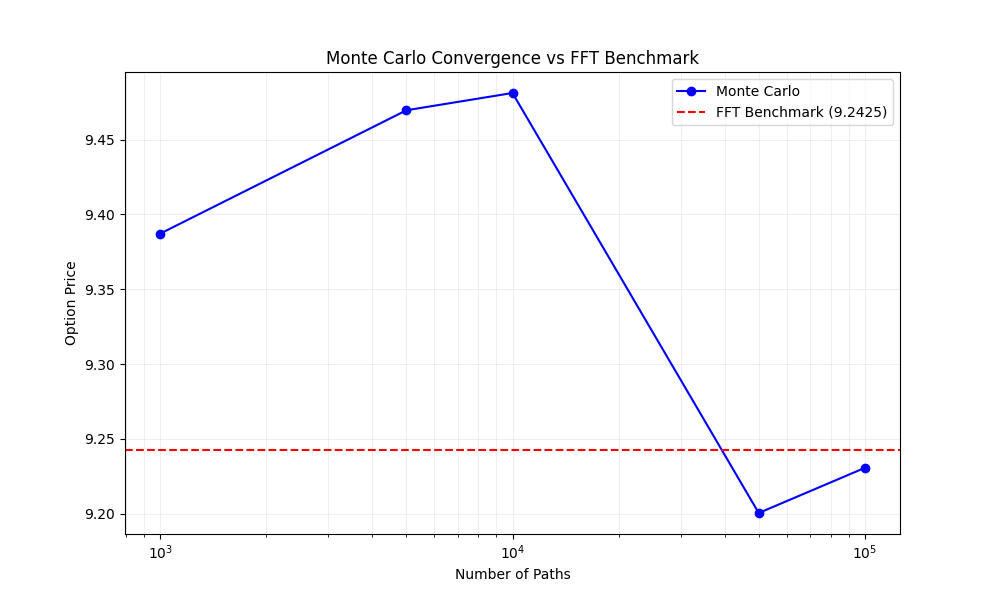
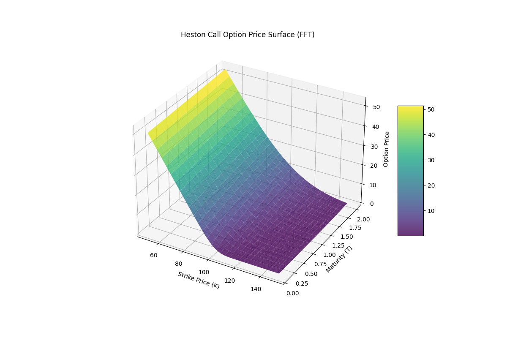

# Heston FFT Pricer Project

This is my implementation of option pricing under the **Heston Stochastic Volatility Model**.
I implemented the **Fast Fourier Transform (FFT)** method (Carr-Madan) and a **Monte Carlo** simulation to compare their efficiency and accuracy.

## Mathematical Background

The goal was to price European Call options where the asset price $S_t$ follows:

```math
dS_t = r S_t dt + \sqrt{v_t} S_t dW^S_t
dv_t = \kappa (\theta - v_t) dt + \sigma \sqrt{v_t} dW^v_t
```

Where:
- $v_t$: Stochastic variance
- $\rho$: Correlation between price and variance shocks ($dW^S_t dW^v_t = \rho dt$)
- $\kappa$: Mean reversion speed
- $\theta$: Long-term variance

### Methods Implemented

**1. Fast Fourier Transform (Carr-Madan, 1999)**
This is the semi-analytical benchmark. It uses the characteristic function of the log-price.
- **Pros**: Extremely fast and accurate.
- **Cons**: Requires complex integration (I used the stable Albrecher et al. formulation).

**2. Monte Carlo Simulation**
I implemented this to validate the FFT results.
- **Optimization**: I used `numba` to parallelize the path generation, which makes it reasonably fast.
- **Scheme**: Euler-Maruyama with Full Truncation for the variance process.

### Benchmark Results

Running on a standard laptop:

| Method | Price | Time (s) | Rel Error (%) |
| :--- | :--- | :--- | :--- |
| **FFT (Carr-Madan)** | 9.2425 | 0.001 | - |
| **Monte Carlo (100k)** | 9.2360 | 3.084 | 0.07% |

## Results

I compared both methods. The Monte Carlo estimator converges to the FFT price as we increase the number of paths.



### Price Surface
The FFT method allows us to quickly compute the option price for a grid of Strikes and Maturities.



### Validation
I checked:
1. **Call-Put Parity**: Holds within numerical error.
2. **Limiting Cases**: Deep ITM/OTM options behave as expected.

## How to run

I used `uv` for dependency management because it's faster, but standard pip works too.

```bash
# Install dependencies
uv sync  # or 'pip install .'

# Run the benchmark
uv run main.py

# Run visualization (plots)
uv run python -m src.visualization.plots

# Run tests
uv run pytest
```

## Difficulties Encountered

- **Branch Cuts**: The standard characteristic function has issues with the complex logarithm. I had to use the "Albrecher" stable form to avoid numerical explosions.
- **Numba Compilation**: Getting `numba` to work with the random number generation took a bit of debugging.

## Future Improvements

- [ ] Add Greeks calculation (Delta, Vega).
- [ ] Implement calibration to market data (using `scipy.optimize`).
- [ ] Add support for American options (using LSMC).
